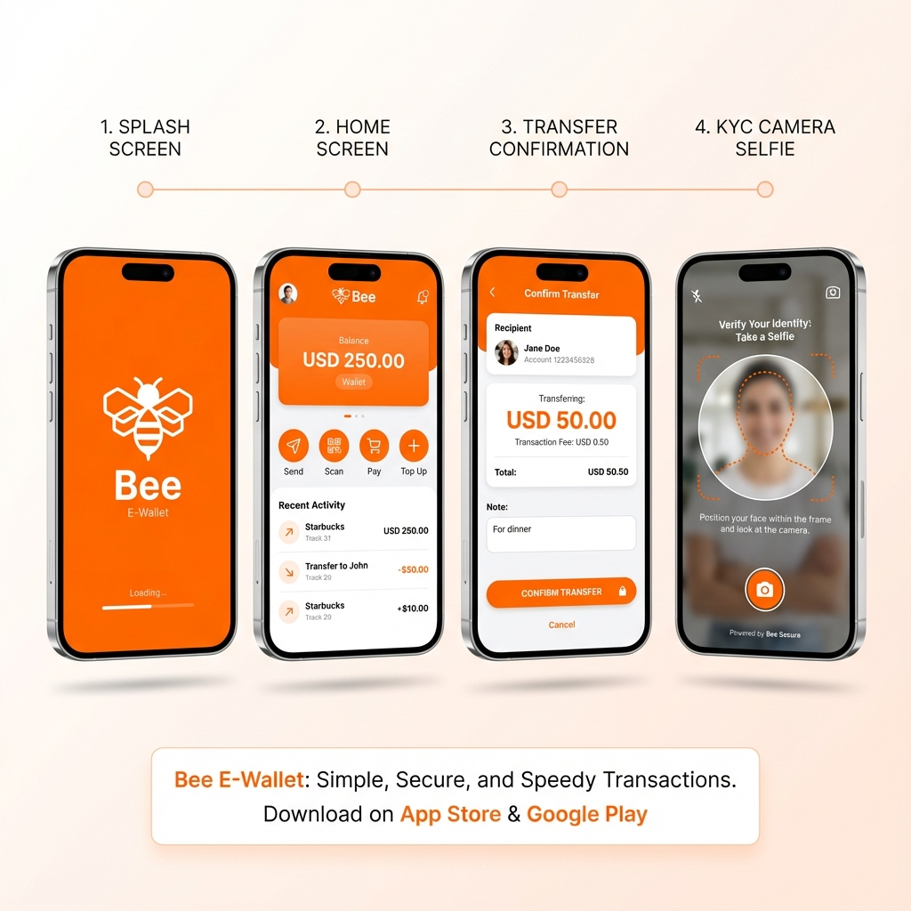
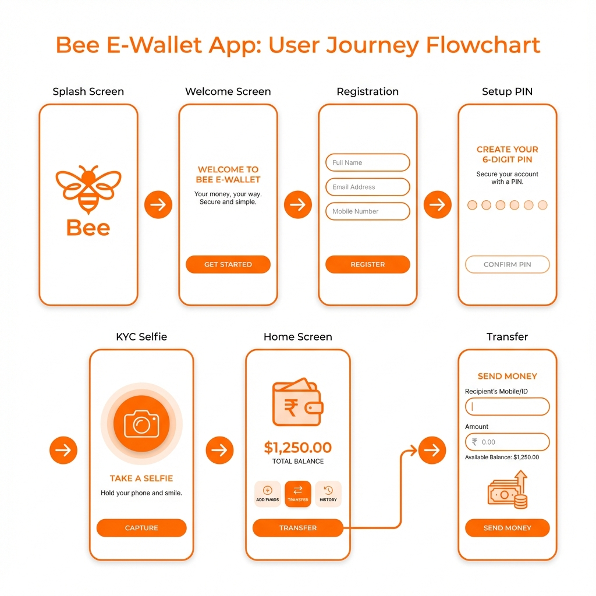

# 📱 Bee E-Wallet Flutter Application

## Dokumentasi Pengembangan Project



---

## 📋 Ringkasan Project

| Info | Detail |
|------|--------|
| **Nama Aplikasi** | Bee E-Wallet |
| **Platform** | Flutter (Android, iOS, Web, Windows) |
| **Bahasa** | Dart |
| **Tanggal** | Desember 2024 |

Bee adalah aplikasi e-wallet (dompet digital) dengan fitur lengkap mulai dari registrasi pengguna, verifikasi identitas (KYC), hingga transfer uang antar pengguna.

---

## 🔄 User Flow



```
Splash → Welcome → Registration → Setup PIN → Confirm PIN → KYC Selfie → KYC Success → Home
                                                                                    ↓
                                                     Profile ← History ← Home → Transfer
```

---

## 🏗️ Arsitektur Project

```
lib/
├── core/
│   ├── constants/        # Colors, Dimensions, Typography
│   ├── theme/            # Material Theme
│   └── utils/            # Responsive Helper
│
├── features/
│   ├── auth/screens/     # 6 screens (splash, welcome, registration, PIN)
│   ├── kyc/screens/      # 2 screens (selfie camera, success)
│   ├── home/screens/     # 3 screens (home, history, profile)
│   └── transfer/screens/ # 4 screens (contacts, amount, confirm, success)
│
├── shared/widgets/       # 8 reusable widgets
│
└── main.dart            # App entry & routing
```

---

## 📦 Dependencies

| Package | Fungsi |
|---------|--------|
| `google_fonts` | Font Inter & Roboto Mono |
| `provider` | State management |
| `shared_preferences` | Local storage |
| `crypto` | PIN hashing |
| `intl` | Currency & date formatting |
| `image_picker` | Gallery picker |
| `camera` | **Live camera preview** |
| `permission_handler` | Camera permission |

---

## 🎨 Design System

### Color Palette

| Warna | Hex | Penggunaan |
|-------|-----|------------|
| Primary Orange | `#FF6B00` | Tombol, aksen utama |
| Secondary Teal | `#1A9B9B` | Aksen sekunder |
| Success Green | `#00C853` | Status sukses |
| Error Red | `#FF4444` | Error, warning |

### Typography

- **Headings:** Google Fonts Inter (Bold)
- **Body:** Google Fonts Inter (Regular)
- **Numbers:** Google Fonts Roboto Mono

---

## 🚀 Fitur yang Dikembangkan

### Phase 1: Core UI Components ✅
- Custom Button (filled & outlined)
- Bee Logo dengan shadow
- Loading Indicator
- PIN Input dengan 6 dots
- Custom Text Field
- Numpad
- Theme system
- Responsive Helper

### Phase 2: Authentication Flow ✅
- Splash Screen dengan animasi
- Welcome Screen
- Registration Screen dengan validasi
- Setup PIN Screen
- Confirm PIN Screen
- PIN Login Screen

### Phase 3: KYC (Know Your Customer) ✅
- **KYC Selfie Screen dengan LIVE CAMERA PREVIEW**
  - Real-time camera feed
  - Face position guide overlay
  - Circular capture button
  - Photo preview
- KYC Success Screen

### Phase 4: Transfer Flow ✅
- Contact List dengan search
- Amount Input dengan currency formatter
- Confirmation Screen
- Success Screen dengan receipt

### Phase 5: Home & Navigation ✅
- Home Screen (balance, quick actions, transactions)
- History Screen (20 mock transactions)
- Profile Screen
- Bottom Navigation Bar

---

## 🐛 Bug Fixes

| Bug | Solusi |
|-----|--------|
| `LocaleDataException` | Tambah `initializeDateFormatting('id_ID')` |
| `Image.file` error di Web | Ganti ke `Image.memory` |
| Camera tidak realtime | Ganti ke `camera` package |
| NDK malformed | Hapus folder NDK & clean |

---

## 📱 Cara Menjalankan

```bash
# Install dependencies
flutter pub get

# Run di Android
flutter run -d <device_id>

# Run di Chrome
flutter run -d chrome
```

---

## 🔮 TODO

- [ ] QRIS Scanner
- [ ] Top Up
- [ ] Share receipt
- [ ] API integration
- [ ] Biometric auth

---

## 👨‍💻 Developer Notes

### Responsive Design
Menggunakan `ResponsiveHelper` untuk adaptive UI berdasarkan lebar device.

### Indonesian Locale
Format: `Rp 1.000.000` dan `08 Des 2024`

### Camera Implementation
KYC Selfie menggunakan `camera` package:
1. Initialize CameraController (front camera)
2. Display CameraPreview widget  
3. Capture dengan `takePicture()`
4. Display dengan `Image.memory()` untuk cross-platform

---

*Dokumentasi dibuat pada 8 Desember 2024*
